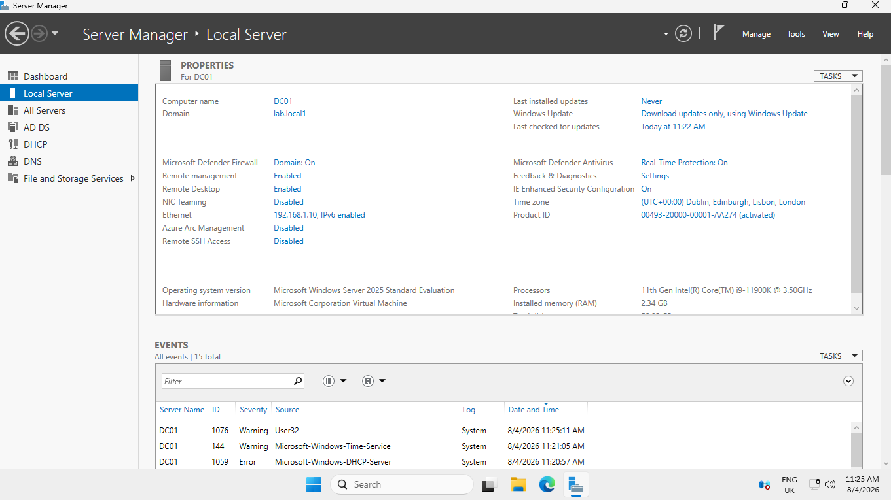
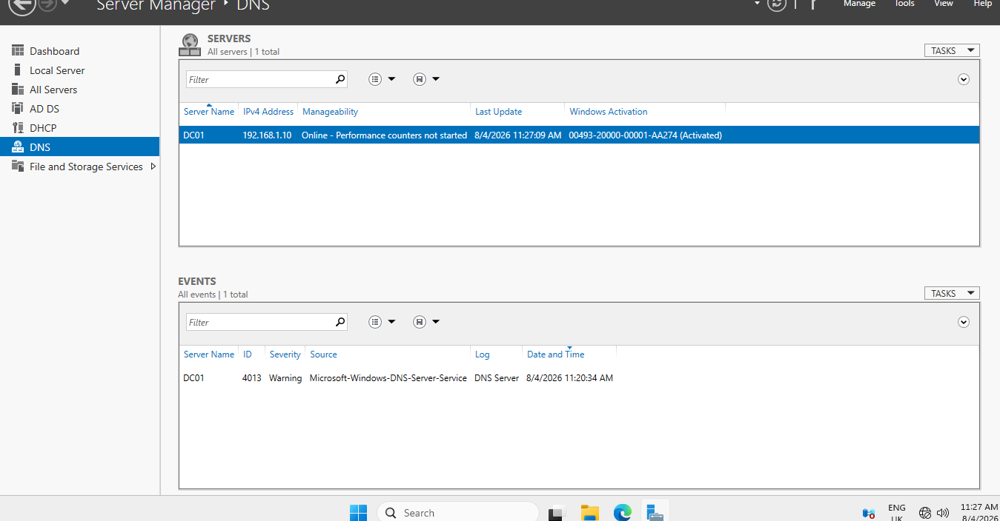
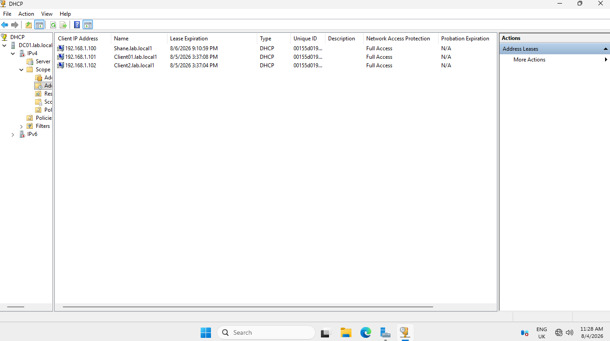

# Windows Server Configuration Documentation

## Overview

This document explains the configuration checks and server roles completed after installing Windows Server in the Hyper-V lab environment.

Before deploying and managing the Active Directory environment, the server was verified and prepared with required network services.

The Windows Server was configured with:

- Server verification.
- DNS Server role.
- DHCP Server role.
- Preparation for Active Directory Domain Services.

---

# Objective

The objectives of this stage were:

- Verify Windows Server was installed correctly.
- Confirm server information.
- Check the current user account.
- Configure DNS services.
- Configure DHCP services.
- Prepare the server for Active Directory installation.

---

# Environment

## Server

- Windows Server Virtual Machine
- Hosted using Microsoft Hyper-V

## Planned Role

The server would later be configured as:

- Domain Controller.
- Active Directory server.
- User and policy management server.
- Network services server.

---

# Step 1: Accessing Windows Server

## Process Completed

After the Windows Server installation was completed:

- Logged into the server.
- Reviewed the Windows Server desktop.
- Confirmed the operating system was working correctly.
- Verified administrative access was available.

---

# Step 2: Verifying Server Name

## Purpose

The server name was checked to identify the machine before further configuration.

A clear naming convention helps administrators identify systems within a network environment.

## PowerShell Command Used

```powershell
hostname
```

## Outcome

The server hostname was displayed and verified successfully.

---

# Step 3: Verifying Logged-In User

## Purpose

The current user session was checked to confirm which account was being used for administration.

## PowerShell Command Used

```powershell
whoami
```

## Outcome

The current logged-in user was displayed successfully.

---

# Step 4: Reviewing Server Manager

## Process Completed

Server Manager was opened to confirm the server was ready for role installation.

Checked:

- Server status.
- Available roles and features.
- Server management options.

---

# Step 5: DNS Server Configuration

## Overview

DNS (Domain Name System) was configured as part of the Windows Server environment.

DNS is an essential service for Active Directory because it allows computers and services to locate the Domain Controller and communicate within the domain.

---

## Tasks Completed

- Installed DNS Server role.
- Reviewed DNS configuration.
- Verified DNS services were running.
- Checked DNS name resolution.

---

## DNS Tools Used

- DNS Manager.
- PowerShell.
- Command Prompt.

---

## DNS Verification Commands

### View Network and DNS Information

```powershell
ipconfig /all
```

Purpose:

Displays network configuration details, including DNS server information.

---

### Test DNS Resolution

```cmd
nslookup
```

Purpose:

Tests whether DNS can successfully resolve names and communicate with DNS servers.

---

## DNS Outcome

DNS was successfully configured and prepared to support the Active Directory domain environment.

---

# Step 6: DHCP Server Configuration

## Overview

DHCP (Dynamic Host Configuration Protocol) was configured to automatically provide network settings to client machines.

DHCP removes the need to manually configure IP addresses on every device.

---

## Tasks Completed

- Installed DHCP Server role.
- Created and configured DHCP scope.
- Configured IP address allocation.
- Configured network settings for client devices.

---

## DHCP Scope Configuration

Settings configured included:

- IP address range.
- Subnet mask.
- Default gateway.
- DNS server address.
- Domain information.

---

## DHCP Verification Commands

### Check Network Configuration

```cmd
ipconfig /all
```

Purpose:

Displays the IP configuration received by the client.

---

### Request New IP Address

```cmd
ipconfig /renew
```

Purpose:

Requests a new IP address from the DHCP server.

---

## DHCP Outcome

DHCP was successfully configured and allowed client machines to automatically receive network settings.

---

# Step 7: Preparing for Active Directory

The server was prepared for the next stage of the project:

- Active Directory Domain Services installation.
- Domain Controller promotion.
- Domain creation.
- User management.
- Group Policy configuration.

---

# Outcome

The Windows Server virtual machine was successfully verified and configured with essential network services.

The server was prepared for Active Directory deployment and further domain configuration.

---

# Screenshots

Evidence to include:







---

# Skills Demonstrated

- Windows Server administration.
- DNS configuration.
- DHCP configuration.
- Network services management.
- Basic PowerShell usage.
- System verification.
- Server preparation.
- IT documentation.

---

# Next Steps

The next stage was:

- Installing Active Directory Domain Services.
- Promoting the server to a Domain Controller.
- Creating the domain environment.
- Managing users and policies.
