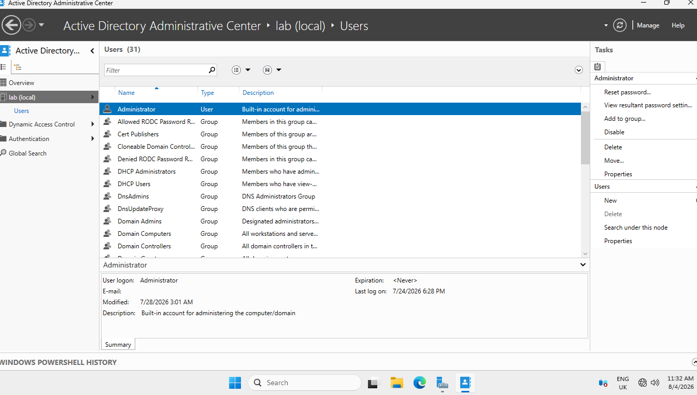

# Active Directory Domain Services Setup Documentation

## Overview

This document explains the installation and configuration of Active Directory Domain Services (AD DS) within the Windows Server lab environment.

Active Directory provides centralised management of users, computers, groups, and permissions within a Windows domain.

---

# Objective

The objectives of this stage were:

- Install the Active Directory Domain Services role.
- Configure Windows Server as a Domain Controller.
- Create a new domain.
- Verify the Active Directory installation.

---

# Environment

## Server

- Windows Server Virtual Machine
- Previously configured using Hyper-V

## Role Installed

- Active Directory Domain Services (AD DS)

---

# Step 1: Installing Active Directory Domain Services

## Process Completed

1. Opened Server Manager.
2. Selected **Add Roles and Features**.
3. Selected **Role-based or feature-based installation**.
4. Selected the local server.
5. Selected **Active Directory Domain Services**.
6. Added the required features.
7. Installed the role.

---

# Step 2: Promoting the Server to a Domain Controller

## Process Completed

After installing AD DS, the server was promoted to a Domain Controller.

Steps:

1. Opened the Server Manager notification area.
2. Selected **Promote this server to a Domain Controller**.
3. Selected **Add a new forest**.
4. Entered the domain name.
5. Configured the Directory Services Restore Mode (DSRM) password.
6. Reviewed the configuration settings.
7. Completed the installation wizard.
8. Restarted the server.

---

# Step 3: Verifying Active Directory Installation

## Process Completed

After restarting the server, the Active Directory configuration was checked.

Verification included:

- Confirming the server was operating as a Domain Controller.
- Opening Active Directory Users and Computers.
- Checking the created domain.
- Confirming Active Directory tools were available.

---

# Step 4: PowerShell Verification

PowerShell was used to verify the domain configuration.

## Command Used

```powershell
Get-ADDomain

---

# Outcome

Active Directory Domain Services was successfully installed and configured within the Windows Server lab environment.

The server was successfully promoted to a Domain Controller and the domain environment was created.

The Active Directory environment was prepared for:

- User account management.
- Computer management.
- Group Policy configuration.
- Domain authentication.
- Helpdesk administration practice.

---

# Screenshots

Evidence included:

- Active Directory Users and Computers.
- Domain Controller configuration.
- Active Directory domain environment.
- PowerShell verification:
  - `Get-ADDomain`

---

## Active Directory Users and Computers



---

## Domain Controller Configuration


---

## PowerShell Verification

PowerShell was used to confirm the Active Directory domain configuration.

Command used:

```powershell
Get-ADDomain
Skills Demonstrated
Active Directory administration.
Domain Controller deployment.
Windows Server configuration.
User and computer management.
Domain authentication concepts.
PowerShell verification.
IT documentation.
Next Steps

The next stage was:

Creating and managing users.
Configuring Group Policy.
Applying security policies.
Testing domain user access.
